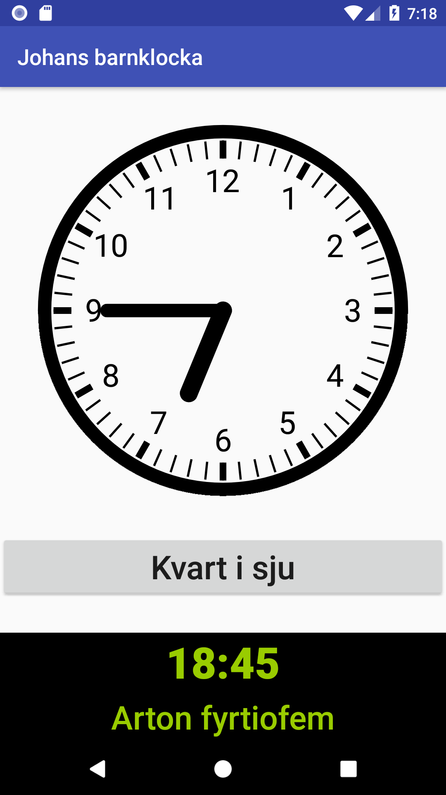

A clock app for helping children learn analog and digital time.

All in Swedish, if you're in Sweden you can [install it from Google
Play](https://play.google.com/store/apps/details?id=com.gmail.walles.johan.johansbarnklocka).

Here's what it looks like:

# TODO
* Make a round launcher icon

## DONE
* Implement hour hand moving
* Implement minute hand moving
* Show a digital clock matching the analog one
* Update digital clock when our hands move
* Make digital clock bigger
* Validate hour changes when moving the minute hand
* Validate 24h time when moving the hour hand
* Show a plain-text readout of the analog clock
* Make digital clock look more like a digital clock
* Speak analog readout text when clicked
* Lock the app orientation to portrait
* Show a plain-text readout of the digital clock
* Speak digital readout text when clicked
* Only enable speech if a Swedish voice is available
* Make an icon
* Make a "Feature Graphic"
* Write a Privacy Policy (yes, I know)
* Get screenshots
* Release on Google Play, but only in Sweden
* Add a link to the source code inside of the app
* Make sure layout works on both wider devices and higher (2:1) ones.
